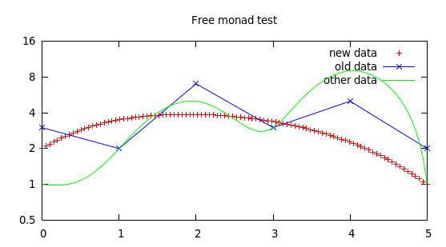

::

    l1 = do
        name "new data"
        color Red
        smooth Sbezier
        style Points
        values [(0,2),(1,5),(2,4),(3,4),(4,3),(5,1)]

    l2 = do
        name "old data"
        color Blue
        style Linespoints
        values $ zip [0..] $ [3,2,7,3,5,2]

    plot1 = do
        title "Free monad test"
        scale $ Logscale Y 2.0
        plot l1
        plot l2
        plot $ do
            name "other data"
            style Lines
            smooth Csplines
            color Green
            values $ zip [0..] [1,2,5,3,9,1]

    wxtplot plot1

::

    ghci> let vs = zip [0..] [1,2,3,4,3,2,1,0]
    ghci> dumbplot $ plot (name "example data" >> smooth Bezier >> values vs)

        4 ++--------+---------+---------+--------+---------+---------+--------++
          +         +         +         +        +         example data ****** +
      3.5 ++                                                                  ++
          |                                                                    |
          |                                                                    |
        3 ++                    ***************                               ++
          |                 *****              ****                            |
      2.5 ++             ***                      ****                        ++
          |            ***                            ***                      |
        2 ++        ***                                  **                   ++
          |       ***                                      ***                 |
          |     ***                                           **               |
      1.5 ++  ***                                               **            ++
          | **                                                    **           |
        1 **                                                        **        ++
          |                                                           **       |
          |                                                             **     |
      0.5 ++                                                              *** ++
          +         +         +         +        +         +         +      ***+
        0 ++--------+---------+---------+--------+---------+---------+--------**
          0         1         2         3        4         5         6         7
